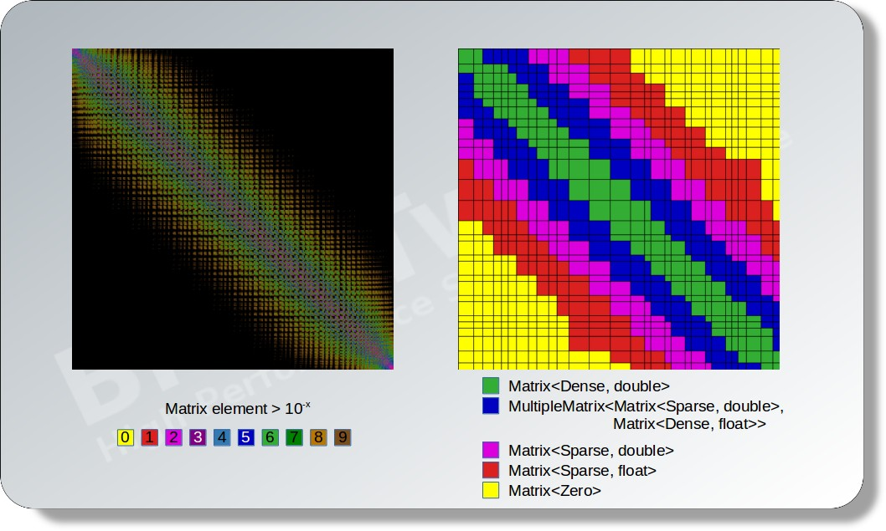
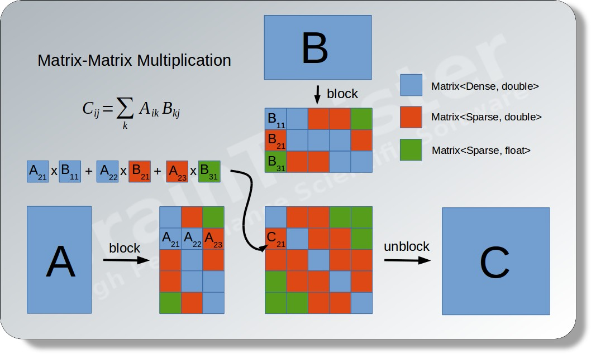
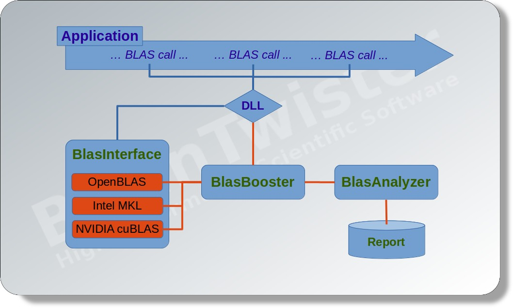

BlasBooster
===========

BLAS library combining dense and sparse algorithms

Copyright (C) 2013-2019 Bernd Doser <bernd.doser@braintwister.eu>

All rights reserved.

BlasBooster is free software made available under the [GPL-3.0 License](https://opensource.org/licenses/GPL-3.0).
For details see [LICENSE.md](LICENSE.md) file.

Algorithms in the field of linear algebra are strictly separated into a dense
and a sparse world. BlasBooster provides an opportunity to combine these two
worlds in a dynamic way by dividing matrices and vectors with respect to their
type, occupation and accuracy, so that in each case the most appropriate
algorithm can by applied.

Let's consider, for instance, a matrix-matrix multiplication. First, the
matrices A and B will be divided into sub-matrices. Then, each sub-matrix will
be converted into their ideal representation with respect to their occupation
and significance. Typical matrix types are:

 - `Matrix<Dense, double>`
 - `Matrix<Dense, float>`
 - `Matrix<Sparse, double>`
 - `Matrix<Sparse, float>`
 - `MultipleMatrix<Matrix<Sparse, double>, Matrix<Dense, float>>`
 - `MultipleMatrix<Matrix<Sparse, double>, Matrix<Sparse, float>>`

Here, the `MultipleMatrix` is a special, composed matrix type which is
comparable to an expression template of a matrix sum. The type
`MultipleMatrix<Sparse, double>, Matrix<Dense, float>>`, for instance,
is useful if a matrix have many small entries which can be stored in single
precision and only some entries which must be stored in double precision.

For the actual multiplication `A x B`, several multiplications of sub-matrices
of different types will be performed and summed up to the the resulting matrix
`C`.

In addition to the direct usage of the BlasBooster interface, the <a
href="http://www.netlib.org/blas" target="_blank">conventional BLAS
standard</a> is also supported. Therefore, it is possible to use BlasBooster
without any changes within your application by only linking the BlasBooster
library instead of the conventional BLAS library like OpenBLAS, IntelMKL, or
NVIDIA cuBLAS. Moreover, the special module BlasAnalyzer assess your
application with respect to the BLAS usage and reports a summary of all
relevant values and timings.

